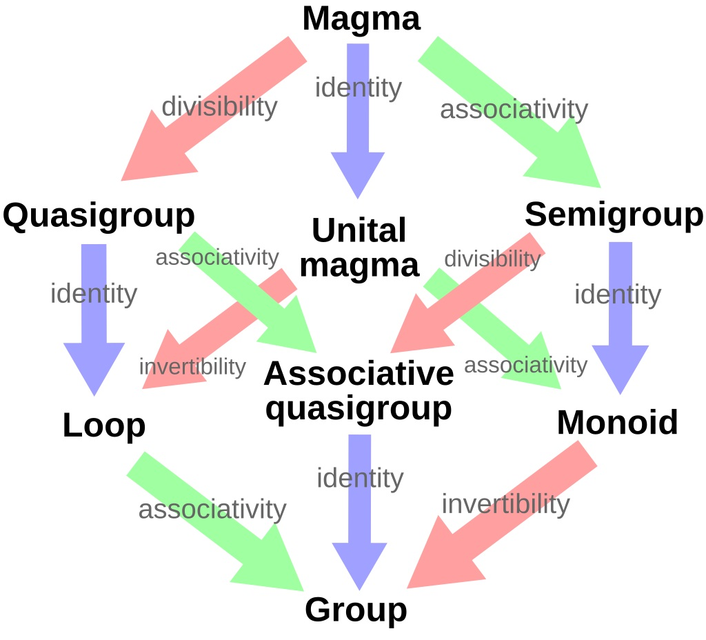

# Problem  26a.

A semigroup is a set \( S \) with a product which associates to each ordered
pair \( (a, b) \) of elements of \( S \) an element \( ab \in S \) in such a way that \( (ab)c = a(bc) \) for any elements \( a, b, c \in S \). Show that the set of all mappings from a given set \( X \) to itself forms a semigroup in which the product is composition of mappings. Show that the set of all one-to-one correspondences of \( X \) with itself forms a group under composition.

---

## Proof

We have two things to show:

1. Show that the set of all mappings from a given
set \( X \) to itself forms a semigroup in which the product is composition of
mappings.
2. Show that the set of all one-to-one correspondences of \( X \) with
itself forms a group under composition.

#### Proof of 1.

Let \(\mathcal F = \mathcal F(X)\) be the set of all functions \(X \rightarrow X\).
We need to show that \((fg)h = f(gh)\) for all \(f, g, h \in \mathcal F\)
We know this is true because composition of function is associative, and we know we can compose the functions since \(f, g, h\) share one the same domain and codomain, namely \(X\), since \(f, g, h \in \mathcal F\).

#### Proof of 2.

One-to-one correspondence (not to be confused with the one-to-one function, which is synonymous with an *injective* mapping), is a synonym for a bijection, that is, a function that is both surjective and injective.

Let \(\mathcal B = \mathcal B (X)\) be the set of all bijective functions (bijections) \(X \rightarrow X\). We need to show that this set is a group under composition, that is, that the group axioms are true in this set, when we equip it with the composition operation.

0. Closure: We know from set theory that a composition of bijections is a bijection, therefore \(f, g \in \mathcal B \implies fg \in \mathcal B, \forall f,g \in \mathcal B\)
1. Associativity: Since \(\mathcal B \subset \mathcal F\), \(\mathcal B\) is a subgroup as well and thus the associativity axiom is inherited.
2. Existence of the identity element: The identity function, defined with \(1(x) := x, \forall x \in X\) is a bijection, and we know from set theory that \(1f = f = f1\) is true for all functions, and particularly for bijections.
3. Existence of an inverse for all elements of \(\mathcal B\): Every bijective function has an inverse function, that is a bijection as well, and its inverse is the function of which it is an inverse. Formally: \(\forall f \in \mathcal B \ \exists f^{-1}\in \mathcal B: ff^{-1}=1=f^{-1}f\), which is what we needed to show.[^1]

---
The proof is complete.

\(\square\)

[^1]: I'll often use results from set theory like this, I took a set theory course last year and I want to focus on algebra, because of that I won't be descending to the set theory realm, and will use those results as given. Additionally, since there is a Set Theory chapter in the book, with many of these results (most probably) proven, I think this is alright.

## Additional thoughts

This problem made me think of [Category Theory](https://en.wikipedia.org/wiki/Category_theory), and its connections with algebra and groups in particular. Let me explain some of these connections. 

In this problem we get introduced to the "semigroup", which is an algebraic structure "weaker" than the group, meaning that we are necessitating less[^2] rules which it has to obey, i.e. we don't care about identity elements, or inverse elements in a semigroup. So, what if we wanted to define an algebraic structure that's a little stronger than the semigroup, and add, say, the identity element axiom to its definition? This would give us the **monoid**, which is essentially a semigroup + identity element axiom. So if we order these structures by their "strength", we get the following ordering: semigroup\(<\)monoid\(<\)group (or, every group is a monoid and a semigroup, every monoid is a semigroup, see image below). Here is where the connection with category theory comes in: **A category with just one object is a monoid. A category with just one object, but where all the morphisms are invertible is a group. Zounds!**

Here is a [MSE thread](https://math.stackexchange.com/questions/655902/a-question-about-groups-as-categories) with some nice answers that explains the connection with groups in particular, towards which this problem hints at, if you are familiar with the definition of a category.

{: style="display: block; margin: 0 auto; width: 350px;"}
<a href="https://en.wikipedia.org/wiki/Monoid">image from wikipedia</a>

[^2]: I say that "weaker" means "... less", but its tacitly meant that the set of rules for the weaker notion (semigroup) is a proper subset of the rules for the stronger notion (group). this is nicely illustrated by the attached image.