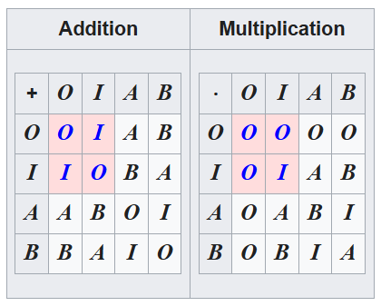

# Exercise 28b.
Let \(a\) be an element of a group \(G\). Show that the mapping \(\lambda_a\colon G \rightarrow G\) given by \(\lambda_a g = ag\) for any \(g \in G\) is a one-to-one correspondence.

---

## *Proof*

One-to-one correspondence is a synonym for a bijective mapping, that is, a mapping that is both surjective (onto) and injective (one-to-one). Our goal here will be to prove that the \(\lambda_a\) mapping is both surjective and injective.

### *Proof* of \(\lambda_a\) being injective
Since \(a \in G\), \(G\) is non-empty. Let \(f,g \in G\), then we have
\[\lambda_a f = af\]
\[\lambda_a g = ag\]
Let's suppose now that \(\lambda_a f = \lambda_a g\). We can rewrite this as \(af = ag\). Since \(a, f, g \in G\), and \(G\) is a group, the cancellation laws hold, and thus we have 
\[\lambda_a f = \lambda_a g \iff af = ag \implies f = g\]
The last implication is what we needed to show, \(\lambda_a\) is indeed injective

### *Proof* of \(\lambda_a\) being surjective
We need to show that for all \(c \in G\), there exists a \(b \in G\), such that \(ab = c\). Let \(c \in G\). We can write \(c\) as \(c = ec = (aa^{-1})c=a(a^{-1}c)\). That is, we get that \(a(a^{-1}c)= c\). Since \(a^{-1} \in G\) as well, the product \(a^{-1}c\) is also in \(G\). We can denote it like \(b = a^{-1}c\), rewriting the derived above we get \(ab=c\), which is what we needed to show. The mapping \(\lambda_a\) is indeed surjective.

We proved that \(\lambda_a\) is both injective and surjective, therefore it is bijective, which is what we needed to show. The proof is complete.

\(\square\)

---

## Additional thoughts
This seemed important to me. Not only that every element of a group can be expressed as a product of two elements of the group, but this exercise tells us that every element can be expressed as a product of two elements of the group, given that one is fixed. In other words, left multiplication by \(a\) defines a bijection of the group onto itself, ensuring that every element can be obtained as a left-multiplication of some element by \(a\). Compare this with the set of real numbers, which is algebraically a field&mdash;can you say that all real numbers are expressible as product of other two real numbers? What about finite, or countable fields? 

Here is a table representing a field with four elements, also known as Galois field with four elements (the subset highlighted in red is also a field, known as the binary field \(\text{F}\) or \(\text{GF(2)}\)).
{: style="display: block; margin: 0 auto; width: 350px;"}
<a href="https://en.wikipedia.org/wiki/Field_(mathematics)#Finite_fields">image from wikipedia</a>
