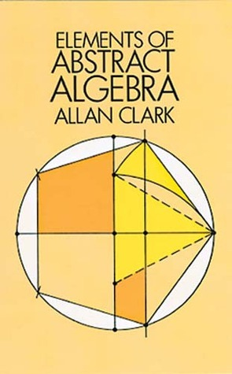
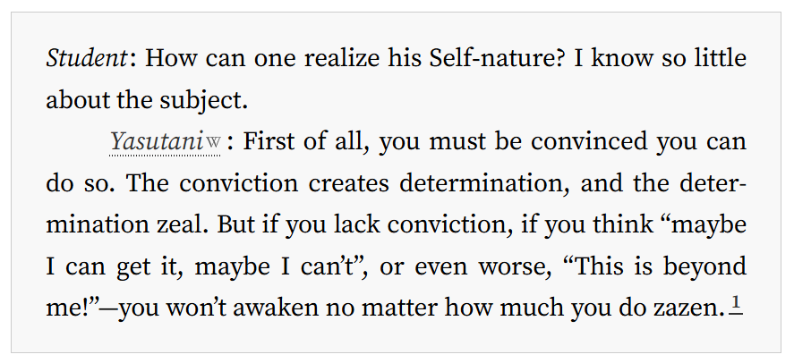

# Attempted solutions of selected problems from Elements of Abstract Algebra by Allan Clarke
{: style="display: block; margin: 0 auto; width: 150px;"}

<!-- {: style="display: block; margin: 0 auto; width: 300px;"} -->

## Overview

*Note&mdash;19. January 2025: solutions are still being posted.*

I'm self-studying this book because I want to study algebraic topology, category theory and other fields that use abstract algebra extensively (all of math?). Here I'll post attempts of solving selected problems that I found interesting. If you find mistakes, or have suggestions, please do let me know. If you would like to discuss a particular problem, or whatever, I'd be happy to hear from you. You can find my contact info at the bottom of this page. When I finish with the book, I plan to enable direct contributions from other people via github, in case someone wants to help make this a complete collection of solutions for this book.

One of the goals of this project is to make explicit the invisible heuristics and tacit knowledge that permeates mathematics, problem solving and proving in particular. Maybe I'll create a "Heuristic index for abstract algebra" at one point. From this, another ambitious goal emerges: making this project become a self-study guide of sorts. Time will tell if this is a tangible goal for this project, since this is an extracurricular activity for me.

## Structure of the project

In general, I follow the structure of the book and every problem has its own page. E.g. [Problem 35a](https://d-atif.github.io/elements-of-abstract-algebra/35a/). Note that I use latin letters in problem enumeration, that is, "35a" instead of "35\(\alpha \)". This is because of limitations of [mkdocs](https://www.mkdocs.org/), which I used to create this website (btw I like mkdocs, it's great). At the bottom of a problem page I'll sometimes post "Additional thoughts", which will be a place for thoughts on how I solved the problem, what heuristic I used, or whatever I have to say, so look out for those. 

## Contact
- email: de.atif\(\zeta\)@gmail.com, \(\zeta=10\)
- mathstodon: https://mathstodon.xyz/@atif

## ><><
{: style="display: block; margin: 0 auto;width: 500px;"}
<a href="https://gwern.net/on-really-trying">image from here</a>

<!-- [center][source]([your-source-url](https://gwern.net/on-really-trying))[/center] -->
